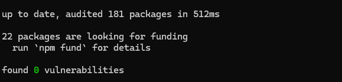
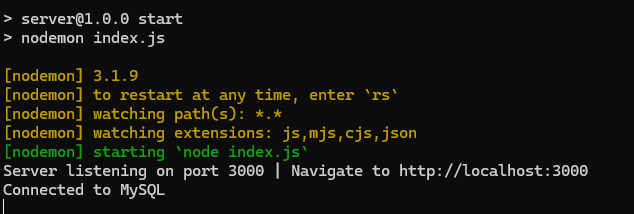
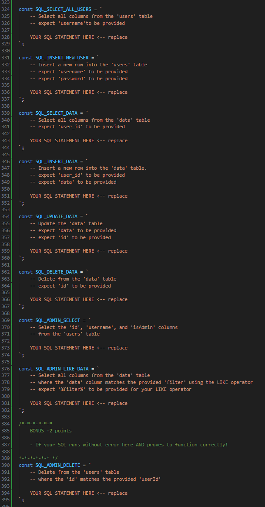

## ITSE 2309 Final Project - Student Instructions

### **Project Setup**

1. **Clone the repository:**
   - Open your command prompt (CMD) or terminal.
   - Navigate to a suitable directory where you want to maintain the project (e.g., `C:\Projects` or `Documents\Code`).
    - Run the following command to clone the repository:
    ```bash
     git clone https://github.com/AC-CIT-SWDEV/ITSE-2309-Final-Project.git
     ```

2. **Install dependencies:**
   - Navigate to the `server` directory within the cloned project:
     - Assuming you're in the directory > \ITSE-2309-Final-Project>
     ```bash
     cd server
     ```

   - Install the required npm packages:

     ```bash
     npm install
     ```
    > You should see this if **npm install** succeeded!\
    ***It may find vulnerabilities, this is okay!***

    

1. **Configure database connection:**
   - Open the `index.js` file within the `server` directory using a text editor.
   - Locate the following line of code:

     ```javascript
     const mysql_db = ''; // <-- 1. CHANGE HERE 
     ```

   - Change `''` to the name of your local MySQL database.

2. **Start the server:**
   - In your command prompt or terminal (while still in the `server` directory), run the following command:

     ```bash
     npm start
     ```

   - This will start the Node.js server and automatically refresh the application whenever you make changes to the code.
   - You can now access the application in your browser at [http://localhost:3000](http://localhost:3000).
    
    > You should see this if **npm start** succeeded!

    

### **Database Setup**

1. **Connect to MySQL:**
   - Open your MySQL Shell.
   - Connect to your local MySQL server using the following command:

     ```sql
     \connect root@localhost
     ```

   - Enter your MySQL root password when prompted.
     - Your password should be **root**
   - Enter SQL mode:

     ```sql
     \sql
     ```

2. **Create tables:**
   - Create the necessary tables in your database!

### **Complete the API Endpoints**

1. **Edit `index.js`:**
   - Navigate back to the `index.js` file within the `server` directory.
   - Locate the sections marked with comments like `-- YOUR SQL STATEMENT HERE`.
   - Write the SQL statements to complete the API endpoints based on the provided instructions and comments.
  
    

2. **Test your code:**
   - Observe the output in your command prompt or terminal for any error messages.
   - Test the functionality of the application in your browser.
   - Use the MySQL Shell to view the data in your database and verify that your SQL statements are working correctly.

### > Good luck, and have fun building your final project!